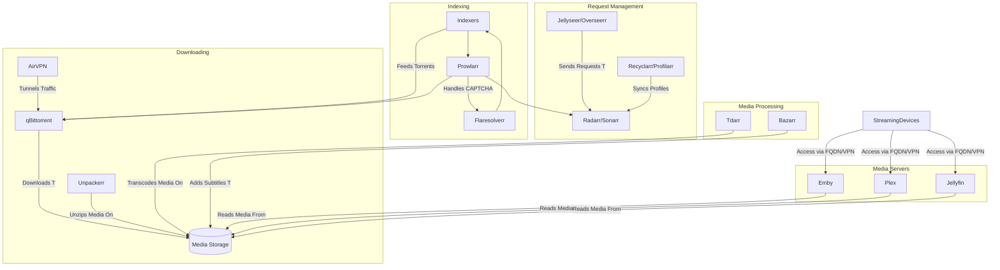

# Visual Map

A full \*arr suite is composed of many apps that all talk to each other to automate your life. This is what they are and what they do:

-   **Prowlarr** - this keeps track of indexers (sites that search for content) and manages their settings to pass them along to other apps
-   **Radarr** - app for managing movies
-   **Sonarr** - app for managing tv shows
-   **Unpackerr** - while not an official arr, still super useful for when you get .rar content and need it to be unzipped/unpacked
-   **qBittorrent** - download client for torrents
-   **Emby**/**Plex**/**Jellyfin** - media servers so u can watch your stuff on multiple devices
-   **Flaresolverr** - an app that helps us get to indexers which are protected by cloudflare
-   **Jellyseerr** - a single interface for both radarr/sonarr which also does recommendations
-   **Recyclarr** - a command line tool to sync TrashGuides to Radarr/Sonarr
-   **Cloudflare** - provider for a fully qualified domain name as well as tunnels to route traffic to your server
-   **AirVPN** - VPN to protect your identity while torrenting
-   **Bazarr** - provides subtitles in case they are missing
-   **Tdarr** - transcodes files on  your harddrive into h.265 to conserve space
- **Huntarr** - finds missing and upgrades low quality media
- **Wizarr** - creates invites to media server for users

# Mermaid Diagram

