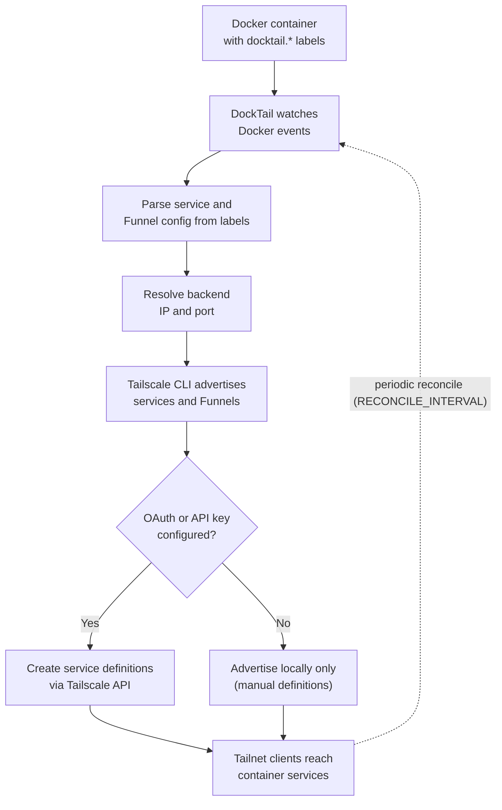

# What is DockTail?

**DockTail** is a lightweight controller that watches your Docker containers, reads `docktail.*` labels, and exposes the matching containers as native **Tailscale Services**. App containers do not need published Docker ports. DockTail proxies straight to each container's Docker network IP, so you can reach apps over your tailnet without poking holes in the host.

The big differentiator is that DockTail uses real Tailscale Services rather than spinning up a separate Tailscale device per app. One tagged host advertises everything, so your apps do not burn through device slots. It is fully stateless, supports HTTP, HTTPS, TCP, and TLS-terminated TCP, can hand out automatic HTTPS certs, and can publish anything to the public internet through Tailscale Funnel.


# How DockTail Works

DockTail runs a continuous reconciliation loop between Docker and Tailscale. It watches Docker events, reads the `docktail.*` labels off each container, works out how to reach the backend, and then drives the Tailscale CLI (and API, if you gave it credentials) to advertise the matching services and Funnels. A periodic reconcile catches container IP changes after restarts.



#  1 · Deploy DockTail

# {.tabset}
## Tailscale on Host

Use this when `tailscaled` is already installed and running on the Docker host. This is the simplest setup. 

Ensure you complete section 2 and its sub. sections before starting the container.

_*Note:_ As we know, Tailscale cannot be installed on the TrueNAS host, only via Docker Container, and Docktail cannot tie into a TrueNAS app as a standalone container.(_There may be a way to do so if the TrueNAS Tailscale app was in the same docker network as Docktail. This would need to be tested_) There would be no way for Docktail to reach the following:
```- /var/run/tailscale:/var/run/tailscale```

#### Compose
```yaml
services:
  docktail:
    image: ghcr.io/marvinvr/docktail:latest
    container_name: docktail
    restart: unless-stopped
    volumes:
      - /var/run/docker.sock:/var/run/docker.sock:ro
      - /var/run/tailscale:/var/run/tailscale
    environment:
      # Optional but recommended. Enables automatic service creation.
      - TAILSCALE_OAUTH_CLIENT_ID=${TAILSCALE_OAUTH_CLIENT_ID}
      - TAILSCALE_OAUTH_CLIENT_SECRET=${TAILSCALE_OAUTH_CLIENT_SECRET}
```

#### Environment
```.example.env
TAILSCALE_OAUTH_CLIENT_ID=
TAILSCALE_OAUTH_CLIENT_SECRET=
```

The host must advertise a tag that matches your ACL auto-approvers before services will be accepted:

```bash
sudo tailscale up --advertise-tags=tag:server --reset
```

> 
> Mount `/var/run/tailscale` as a **directory**, not the socket file directly. When `tailscaled` restarts it recreates the socket with a new inode, and a directory mount stays in sync. The `--reset` flag briefly drops Tailscale, so if you are SSHed in over Tailscale your session may stall until it reconnects.
{.is-warning}

## Tailscale Sidecar

Use this when you do **not** want or cannot install Tailscale directly on the host. DockTail talks to a dedicated Tailscale sidecar container over a shared socket volume.

Ensure you complete section 2 and its sub. sections before starting the container stack.

If you already have Tailscale installed, you will need to add the ```docktail:``` and ```.env``` sections to your Tailscale ```docker-compose.yaml``` file. Additionally, include the environment variable ```- TS_EXTRA_ARGS=--advertise-tags=tag:server``` under the Tailscale service. Note that any arguments you previously used must be included in this section to ensure the Tailscale container starts properly. Otherwise, you’ll see an error in the container logs indicating the arguments that were previously applied.

#### Compose
```yaml
services:
  tailscale:
    image: tailscale/tailscale:latest
    hostname: docktail-host
    environment:
      - TS_AUTHKEY=${TAILSCALE_AUTH_KEY}
      - TS_ROUTES=192.168.1.0/24 #This makes your TrueNAS server a subnet router on your tailnet
      - TS_EXTRA_ARGS=--advertise-tags=tag:server --advertise-exit-node
      - TS_STATE_DIR=/var/lib/tailscale
      - TS_SOCKET=/var/run/tailscale/tailscaled.sock
      - TS_USERSPACE=false
    volumes:
      - /mnt/tank/configs/tailscale:/var/lib/tailscale
      - tailscale-socket:/var/run/tailscale
      - /dev/net/tun:/dev/net/tun
    cap_add:
      - NET_ADMIN
      - SYS_MODULE
    network_mode: host
    restart: unless-stopped

  docktail:
    image: ghcr.io/marvinvr/docktail:latest
    container_name: docktail
    depends_on:
      - tailscale
    restart: unless-stopped
    volumes:
      - /var/run/docker.sock:/var/run/docker.sock:ro
      - tailscale-socket:/var/run/tailscale
    environment:
      - TAILSCALE_OAUTH_CLIENT_ID=${TAILSCALE_OAUTH_CLIENT_ID}
      - TAILSCALE_OAUTH_CLIENT_SECRET=${TAILSCALE_OAUTH_CLIENT_SECRET}

volumes:
  tailscale-state:
  tailscale-socket:
```

#### Environment
```.example.env
TAILSCALE_AUTH_KEY=
TAILSCALE_OAUTH_CLIENT_ID=
TAILSCALE_OAUTH_CLIENT_SECRET=
```

Generate `TAILSCALE_AUTH_KEY` in the Tailscale Admin Console under **Settings -> Keys**. The sidecar should advertise `tag:server` so it satisfies the ACL auto-approver below.

> 
> The sidecar's OAuth client needs the extra **Keys -> Auth Keys: Write** scope so it can mint its own auth key. The host method does not.
{.is-info}


# 2 · Tailscale Admin Setup

DockTail can advertise services locally with no API credentials, but giving it OAuth (recommended) or an API key lets it create the service definitions in the Tailscale Admin Console automatically.

## 2.1 OAuth Credentials

OAuth is preferred because it does not expire like API keys do.

1. Open **Tailscale Admin Console -> Settings -> OAuth clients**.
2. Create a client scoped to your server tag, for example `tag:server`.
3. Grant these permissions:
   - **General -> Services: Write**
   - **Devices -> Core: Write**
   - **Keys -> Auth Keys: Write** (only needed for the sidecar method)
4. Drop the credentials into DockTail's environment (or load them from files, see the Reference section).

> 
> If both OAuth and an API key are configured, DockTail uses OAuth.
{.is-info}

## 2.2 ACL Configuration

Your tailnet ACL needs the tags defined in `tagOwners` plus an `autoApprovers.services` rule that lets the host advertise container services.

```json
{
  "tagOwners": {
    "tag:server": ["autogroup:admin"],
    "tag:container": ["tag:server"]
  },
  "autoApprovers": {
    "services": {
      "tag:container": ["tag:server"]
    }
  }
}
```

`tag:server` is the host (or sidecar auth key) running DockTail. `tag:container` is the default tag DockTail assigns to the services it creates. If you manage ACLs via GitOps, both tags must exist in `tagOwners` or Tailscale rejects the policy.

> 
> The first time a brand new service is advertised, you may need to approve it once in the **Services** tab of the Admin Console. After that it survives container restarts.
{.is-warning}

# 3 · Labels

DockTail watches containers carrying `docktail.*` labels. Each container can become a private Tailscale service, a public Funnel, or both. By default DockTail proxies directly to the container's Docker network IP, so **no port publishing is required**.

## 3.1 Service Labels

| Label | Required | Default | Description |
|-------|----------|---------|-------------|
| `docktail.service.enable` | Yes | - | Enable a private Tailscale service for the container. |
| `docktail.service.name` | Yes | - | Service name, e.g. `web` or `api`. |
| `docktail.service.port` | Yes | - | Backend container port to proxy to. |
| `docktail.service.direct` | No | `true` | Proxy directly to the container IP instead of a published host port. |
| `docktail.service.network` | No | `bridge` / first available | Docker network used for direct IP detection. |
| `docktail.service.protocol` | No | Smart | Backend (container-facing) protocol. |
| `docktail.service.service-port` | No | Smart | Port Tailscale listens on. |
| `docktail.service.service-protocol` | No | Smart | Tailscale-facing protocol. |
| `docktail.tags` | No | `tag:container` | Comma-separated service tags. |


**Smart defaults:**

- `protocol` is `https` when the backend port is `443`, otherwise `http`.
- `service-port` is `443` when `service-protocol` is `https`, otherwise `80`.
- `service-protocol` is `https` when the service port is `443`, `tcp` when the backend is TCP, otherwise `http`.

## 3.2 Multiple Services From One Container

One container can expose several services using numbered labels. Each index needs its own `name` and `port`; tags and network settings are inherited from the primary config.

```yaml
labels:
  - "docktail.service.enable=true"
  - "docktail.service.name=qbittorrent"
  - "docktail.service.port=8000"
  - "docktail.service.1.name=bitmagnet"
  - "docktail.service.1.port=8001"
```

Per-index overridable labels: `name`, `port`, `service-port`, `protocol`, `service-protocol`.

## 3.3 Funnel Labels

Funnel exposes a service to the **public internet**. It can ride alongside a private service or run on its own for funnel-only containers.

| Label | Required | Default | Description |
|-------|----------|---------|-------------|
| `docktail.funnel.enable` | Yes | `false` | Enable Tailscale Funnel. |
| `docktail.funnel.port` | Yes | - | Backend container port for Funnel traffic. |
| `docktail.funnel.funnel-port` | No | `443` | Public Funnel port. HTTPS/HTTP supports `443`, `8443`, or `10000`. |
| `docktail.funnel.protocol` | No | `https` | `http`, `https`, `tcp`, or `tls-terminated-tcp`. |
| `docktail.funnel.path` | No | `/` | HTTP(S) Funnel path. Must start with `/`. |


> 
> Funnel URLs use the **machine hostname**, not the Tailscale service name. HTTP(S) Funnels can share a public port if each uses a different `path`; TCP and TLS-terminated TCP Funnels allow only one Funnel per public port on a node.
{.is-info}

# 4 · Examples

These show only the labels you add to the **app** container. DockTail is assumed to already be running on the same host.

## 4.1 Simple Web App

```yaml
services:
  nginx:
    image: nginx:latest
    labels:
      - "docktail.service.enable=true"
      - "docktail.service.name=web"
      - "docktail.service.port=80"
```

Reachable at `http://web.your-tailnet.ts.net`.

## 4.2 HTTPS With Auto TLS

```yaml
services:
  api:
    image: myapi:latest
    labels:
      - "docktail.service.enable=true"
      - "docktail.service.name=api"
      - "docktail.service.port=3000"
      - "docktail.service.service-port=443"
```

Reachable at `https://api.your-tailnet.ts.net`.

## 4.3 Database Over TCP

```yaml
services:
  postgres:
    image: postgres:16
    labels:
      - "docktail.service.enable=true"
      - "docktail.service.name=db"
      - "docktail.service.port=5432"
      - "docktail.service.protocol=tcp"
      - "docktail.service.service-port=5432"
```

## 4.4 Private Service Plus Public Funnel

```yaml
services:
  website:
    image: nginx:latest
    labels:
      - "docktail.service.enable=true"
      - "docktail.service.name=website"
      - "docktail.service.port=80"
      - "docktail.service.service-port=443"
      - "docktail.funnel.enable=true"
      - "docktail.funnel.port=80"
```

Tailnet URL: `https://website.your-tailnet.ts.net`
Public Funnel URL: `https://your-machine.your-tailnet.ts.net`

## 4.5 Funnel-Only Public Proxy

```yaml
services:
  immich-public-proxy:
    image: ghcr.io/immich-app/immich-public-proxy:latest
    labels:
      - "docktail.funnel.enable=true"
      - "docktail.funnel.port=3000"
      - "docktail.funnel.funnel-port=8443"
```

Public at `https://your-machine.your-tailnet.ts.net:8443`.


