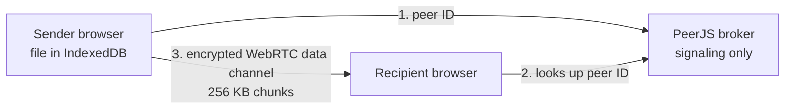

#  What is Giraffile?

**Giraffile** is a tiny, self-hostable web app for sending files straight from one browser to another. There is no upload, no storage backend and no account — you drop a file in, get a short link (or a QR code), and the file streams peer-to-peer over WebRTC to whoever opens that link. When the timer runs out, the link dies.


# 1 · How It Works

The sender's browser holds the file in **IndexedDB** and stands up a PeerJS peer named after the link ID. The recipient opens the link, connects to that peer ID, and the file is pushed across an encrypted WebRTC data channel in 256 KB chunks with backpressure control. Nothing is ever written to a server.



> **The sender's tab must stay open and online for the entire transfer.** There is no store-and-forward. If the sender closes the tab, navigates away, or lets the timer expire, the link is dead and the file is gone.
{.is-danger}

## 1.1 Capabilities

- **Max transfer size:** 1.5 GB (chunked, so large files do not blow up browser memory)
- **Expiration options:** 2, 5 or 10 minutes
- **Multiple files:** bundled client-side into a ZIP with JSZip
- **QR code:** generated alongside every link for handing off to a phone
- **Two receive modes:** *save to disk* (streams straight to the filesystem, never expires once written) or *view in browser* (held in memory, destroyed on expiry)
- **Languages:** English and Spanish, with a light/dark theme toggle

> Save-to-disk streaming uses the File System Access API, which needs **Chromium (Chrome / Edge / Opera) over a secure context**. Firefox and Safari fall back to the in-memory path. See section 3 for why this makes HTTPS mandatory on a self-hosted instance.
{.is-info}

#  2 · Deploy Giraffile

There is no published image. Clone the repo and serve the folder with nginx.

```bash
cd /mnt/tank/stacks && git clone https://github.com/coffeetron832/Giraffile.git
```

In Dockge, use this for your compose stack:

```yaml
services:
  giraffile:
    image: nginx:alpine
    container_name: giraffile
    restart: unless-stopped
    ports:
      - "8085:80"
    volumes:
      - /mnt/tank/configs/giraffile/site:/usr/share/nginx/html:ro
```


# 3 · Reverse Proxy and HTTPS

Serve Giraffile over TLS. This is not optional polish — two things break without it:

- **Save-to-disk streaming** requires a secure context, so plain `http://192.168.x.x:8085` silently drops every recipient into the memory-only path
- **Share links are absolute.** The generated link is `<your-origin>/<path>#<file-id>`, so the recipient must be able to reach your instance at the same URL you do. A LAN-only IP will not work for anyone outside the LAN.

Decide which one you want before you publish links:

| Use case | Setup |
|----------|-------|
| Internal only | Internal DNS name + internal CA or Let's Encrypt via DNS-01, LAN/VPN access only |
| Sharing outside the house | Public hostname through your reverse proxy, valid public certificate |


> Exposing Giraffile publicly exposes a static page, not your files — there is no upload endpoint and no storage to attack. The real consideration is that anyone who can reach the page can use your instance to broker their own transfers.
{.is-info}

# 4 · Using It

1. Open your instance and drag the file (or files) onto the drop zone
2. Pick an expiration: 2, 5 or 10 minutes
3. Click generate — copy the link or show the QR code
4. **Leave the tab open.** Send the link to the recipient and wait for the transfer to finish
5. The recipient chooses *save to disk* or *view in browser*, and the transfer streams across

> The expiry timer starts when the link is generated, not when the recipient opens it
{.is-warning}


