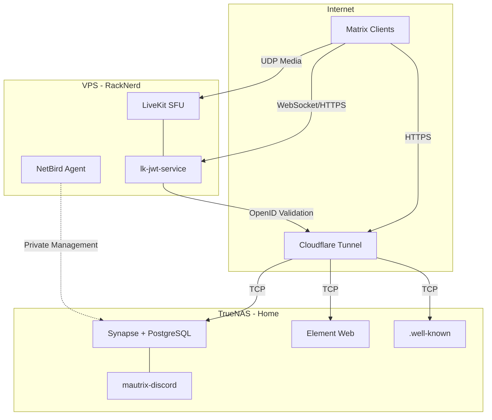

#  What is Matrix?

**Matrix** is an open, federated protocol for real-time communication. It supports text messaging, voice/video calls, file sharing, and bridging to other platforms like Discord. By self-hosting a Matrix homeserver, you own your data and can federate with the broader Matrix network or keep things private.

This guide covers a full Matrix deployment across two hosts: **Synapse** (the homeserver) and supporting services on TrueNAS at home behind a Cloudflare Tunnel, and **LiveKit** (the MatrixRTC voice/video backend) on a remote VPS — ensuring your home IP is never exposed.

# Architecture Overview



| Component | Host | Image | Purpose |
|-----------|------|-------|---------|
| Synapse | TrueNAS | `matrixdotorg/synapse:latest` | Matrix homeserver |
| PostgreSQL | TrueNAS | `postgres:16-alpine` | Database for Synapse |
| mautrix-discord | TrueNAS | `dock.mau.dev/mautrix/discord:latest` | Discord bridge |
| Element Web | TrueNAS | `vectorim/element-web:latest` | Browser client (optional) |
| LiveKit SFU | VPS | `livekit/livekit-server:latest` | Voice/video media routing |
| lk-jwt-service | VPS | `ghcr.io/element-hq/lk-jwt-service:latest` | MatrixRTC auth tokens |

#  1 · Deploy Synapse (TrueNAS)

## 1.1 Generate Configuration

Before deploying the full stack, create a temporary compose file to generate the Synapse config. Create this in Dockge as a one-time stack:

```yaml
services:
  synapse-generate:
    image: matrixdotorg/synapse:latest
    container_name: synapse-generate
    environment:
      - SYNAPSE_SERVER_NAME=serversatho.me
      - SYNAPSE_REPORT_STATS=no
    volumes:
      - /mnt/tank/configs/synapse/data:/data
    command: generate
```

Run the stack — it will generate the config files and exit. Once complete, remove this temporary stack from Dockge.

> 
> The `SYNAPSE_SERVER_NAME` is your **identity domain** — it appears in user IDs like `@evan:serversatho.me`. This cannot be changed after setup. It does not need to be the same as the URL where Synapse is hosted (that's what `.well-known` delegation handles).
{.is-warning}

## 1.2 Edit homeserver.yaml

After generation, edit `/mnt/tank/configs/synapse/data/homeserver.yaml`:

**Set the public base URL:**
```yaml
public_baseurl: "https://matrix.serversatho.me/"
```

**Switch from SQLite to PostgreSQL:**
```yaml
database:
  name: psycopg2
  args:
    user: synapse
    password: YOUR_SECURE_PASSWORD
    database: synapse
    host: synapse-db
    cp_min: 5
    cp_max: 10
```

**Configure the HTTP listener (behind reverse proxy):**
```yaml
listeners:
  - port: 8008
    tls: false
    type: http
    x_forwarded: true
    resources:
      - names: [client, federation]
        compress: false
```

**Disable open registration (recommended):**
```yaml
enable_registration: false
```

## 1.3 Docker Compose — Synapse Stack

Deploy this in Dockge on TrueNAS:

```yaml
services:
  synapse:
    image: matrixdotorg/synapse:latest
    container_name: synapse
    restart: unless-stopped
    environment:
      - SYNAPSE_CONFIG_PATH=/data/homeserver.yaml
    volumes:
      - /mnt/tank/configs/synapse/data:/data
    ports:
      - 8008:8008
    depends_on:
      - synapse-db
    healthcheck:
      test: ["CMD", "curl", "-fSs", "http://localhost:8008/health"]
      interval: 15s
      timeout: 5s
      retries: 3
      start_period: 5s

  synapse-db:
    image: postgres:16-alpine
    container_name: synapse-db
    restart: unless-stopped
    environment:
      - POSTGRES_USER=synapse
      - POSTGRES_PASSWORD=YOUR_SECURE_PASSWORD
      - POSTGRES_DB=synapse
      - POSTGRES_INITDB_ARGS=--encoding=UTF-8 --lc-collate=C --lc-ctype=C
    volumes:
      - /mnt/tank/configs/synapse/postgres-data:/var/lib/postgresql/data
```

> 
> Add a Cloudflare Tunnel route for `matrix.serversatho.me` pointing to `http://localhost:8008`.
{.is-info}

## 1.4 Create an Admin User

After the stack is running:

```bash
docker exec -it synapse register_new_matrix_user -c /data/homeserver.yaml http://localhost:8008
```

Follow the prompts to create your first admin account.

## 1.5 .well-known Delegation

Your main domain `serversatho.me` needs to serve `.well-known` files so that Matrix clients and other federated servers can find your homeserver and LiveKit instance. These can be served by Synapse itself, a static web server, or configured in Cloudflare.

**`/.well-known/matrix/server`** (federation):
```json
{
  "m.server": "matrix.serversatho.me:443"
}
```

**`/.well-known/matrix/client`** (client discovery + MatrixRTC):
```json
{
  "m.homeserver": {
    "base_url": "https://matrix.serversatho.me"
  },
  "org.matrix.msc4143.rtc_foci": [
    {
      "type": "livekit",
      "livekit_service_url": "https://rtc.serversatho.me"
    }
  ]
}
```

> 
> The `rtc_foci` entry is what tells Matrix clients where to find the LiveKit SFU for voice/video calls. Without this, calls will not work.
{.is-warning}

# 2 · Deploy mautrix-discord Bridge (TrueNAS)

The [mautrix-discord](https://github.com/mautrix/discord) bridge enables bidirectional message syncing between Discord and Matrix.

## 2.1 Docker Compose

Add this as a separate stack in Dockge, or add it to the Synapse stack:

```yaml
services:
  mautrix-discord:
    image: dock.mau.dev/mautrix/discord:latest
    container_name: mautrix-discord
    restart: unless-stopped
    volumes:
      - /mnt/tank/configs/mautrix-discord:/data
```

## 2.2 Generate and Edit Config

On first run, the container will generate a `config.yaml` in the data directory and then exit. Edit `/mnt/tank/configs/mautrix-discord/config.yaml`:

```yaml
homeserver:
  address: http://synapse:8008
  domain: serversatho.me

appservice:
  address: http://mautrix-discord:29334
  database:
    type: sqlite3-fk-wal
    uri: /data/mautrix-discord.db

bridge:
  permissions:
    "serversatho.me": user
    "@evan:serversatho.me": admin
```

> 
> If mautrix-discord is in a separate Dockge stack from Synapse, you'll need a shared Docker network between them so `http://synapse:8008` resolves. Alternatively, use the Cloudflare Tunnel URL `https://matrix.serversatho.me` as the homeserver address.
{.is-info}

## 2.3 Register the Appservice

Copy the generated `registration.yaml` from the mautrix-discord data directory into Synapse's appservices directory:

```bash
cp /mnt/tank/configs/mautrix-discord/registration.yaml /mnt/tank/configs/synapse/data/appservices/discord-registration.yaml
```

Add it to `homeserver.yaml`:

```yaml
app_service_config_files:
  - /data/appservices/discord-registration.yaml
```

Restart both Synapse and mautrix-discord after this change.

## 2.4 Link Your Discord Account

From your Matrix client, start a chat with `@discordbot:serversatho.me` and send:

```
login
```

Follow the instructions to authenticate with Discord. Once linked, the bridge will sync your Discord servers into Matrix rooms.

# 3 · Deploy LiveKit MatrixRTC (VPS)

LiveKit replaces the old coturn-based calling model entirely. It acts as an SFU (Selective Forwarding Unit) that routes voice/video streams between participants with end-to-end encryption. Its built-in TURN server handles firewall traversal — no separate coturn needed.

## 3.1 Firewall (UFW)

On the VPS, open the required UDP ports:

```bash
sudo ufw allow 3478/udp         # LiveKit built-in TURN
sudo ufw allow 50000:50100/udp  # LiveKit media relay range
```

> 
> No TCP ports need to be opened — all HTTPS signaling goes through the Cloudflare Tunnel on the VPS. Docker is not bypassing UFW here because the Cloudflare Tunnel connector handles ingress without port mappings.
{.is-info}

## 3.2 LiveKit Configuration

Create the LiveKit config file on the VPS at the path you'll mount into the container (e.g., `/home/user/stacks/livekit/livekit.yaml`):

```yaml
port: 7880
rtc:
  node_ip: YOUR_VPS_PUBLIC_IP
  port_range_start: 50000
  port_range_end: 50100
  use_external_ip: true
  tcp_port: 7881
turn:
  enabled: true
  udp_port: 3478
keys:
  YOUR_LIVEKIT_API_KEY: YOUR_LIVEKIT_API_SECRET
logging:
  level: info
```

> 
> Replace `YOUR_VPS_PUBLIC_IP` with the actual public IP of your VPS. LiveKit cannot auto-discover its public IP when behind a Cloudflare Tunnel, so this must be set manually. Without it, clients won't know where to send UDP media packets.
{.is-danger}

> 
> Generate secure random strings for the API key (20 characters) and secret (64 characters). These same values are used in the lk-jwt-service configuration.
{.is-warning}

## 3.3 Docker Compose — LiveKit Stack

Deploy this in Dockge on the VPS:

```yaml
services:
  livekit:
    image: livekit/livekit-server:latest
    container_name: livekit
    command: --config /etc/livekit.yaml
    restart: unless-stopped
    network_mode: host
    volumes:
      - ./livekit.yaml:/etc/livekit.yaml:ro

  lk-jwt-service:
    image: ghcr.io/element-hq/lk-jwt-service:latest
    container_name: lk-jwt-service
    restart: unless-stopped
    network_mode: host
    environment:
      - LIVEKIT_JWT_BIND=:8081
      - LIVEKIT_URL=wss://rtc.serversatho.me
      - LIVEKIT_KEY=YOUR_LIVEKIT_API_KEY
      - LIVEKIT_SECRET=YOUR_LIVEKIT_API_SECRET
      - LIVEKIT_FULL_ACCESS_HOMESERVERS=serversatho.me
```

> 
> Both services use `network_mode: host` — no `ports:` mappings are used on the VPS. This avoids Docker's iptables rules bypassing UFW. LiveKit binds directly for UDP media performance, and lk-jwt-service binds to `localhost:8081` where the Cloudflare Tunnel can reach it. Since port 8081 is not opened in UFW, it is not exposed to the internet.
{.is-info}

> 
> The `LIVEKIT_FULL_ACCESS_HOMESERVERS` setting controls which homeservers can create new LiveKit rooms. Users from other federated servers can join existing calls but won't be able to initiate them.
{.is-info}

## 3.4 Cloudflare Tunnel Routes (VPS)

Add two routes to the Cloudflare Tunnel running on the VPS. Because lk-jwt-service and LiveKit listen on different ports, you need separate tunnel entries with path-based routing:

| Hostname | Path | Service | Purpose |
|----------|------|---------|---------|
| `rtc.serversatho.me` | `/sfu/get` | `http://localhost:8081` | lk-jwt-service (MatrixRTC auth) |
| `rtc.serversatho.me` | `/*` (catch-all) | `http://localhost:7880` | LiveKit WebSocket signaling |
{.dense}

> 
> In the Cloudflare Zero Trust dashboard, add `rtc.serversatho.me` as a public hostname twice — once with the path `/sfu/get` pointing to `http://localhost:8081`, and once without a path (catch-all) pointing to `http://localhost:7880`. The `/sfu/get` route must be listed **first** so it takes priority. Both services are reachable on localhost because they use `network_mode: host`.
{.is-warning}

## 3.5 How Calls Work

1. Client reads `/.well-known/matrix/client` from `serversatho.me` and discovers the LiveKit URL (`rtc.serversatho.me`)
2. Client requests a JWT from lk-jwt-service at `https://rtc.serversatho.me/sfu/get`, providing an OpenID token from Synapse
3. lk-jwt-service validates the token against Synapse and returns a signed LiveKit JWT
4. Client connects to the LiveKit SFU using the JWT over WebSocket (through the Cloudflare Tunnel)
5. Voice/video media flows directly over UDP between the client and LiveKit on the VPS public IP
6. Home IP is never exposed — all signaling goes through tunnels, all media goes through the VPS

# 4 · Deploy Element Web (TrueNAS, Optional)

If you want a browser-based client:

```yaml
services:
  element-web:
    image: vectorim/element-web:latest
    container_name: element-web
    restart: unless-stopped
    ports:
      - 8090:80
    volumes:
      - /mnt/tank/configs/element-web/config.json:/app/config.json:ro
```

Create `/mnt/tank/configs/element-web/config.json`:

```json
{
  "default_server_config": {
    "m.homeserver": {
      "base_url": "https://matrix.serversatho.me",
      "server_name": "serversatho.me"
    }
  },
  "brand": "Servers@Home Chat"
}
```

Add a Cloudflare Tunnel route for `chat.serversatho.me` pointing to `http://localhost:8090`.

# 5 · Configuration

## 5.1 Network Summary

| Traffic Type | Path | Protocol |
|-------------|------|----------|
| Client API / Federation | Client → Cloudflare Tunnel → Synapse (TrueNAS) | HTTPS (TCP) |
| Voice/Video Signaling | Client → Cloudflare Tunnel → LiveKit (VPS) | WSS (TCP) |
| Voice/Video Media | Client → LiveKit (VPS public IP) | UDP |
| Discord Bridge | mautrix-discord → Discord API (outbound only) | HTTPS (TCP) |
| Admin Management | NetBird mesh (private) | WireGuard |
{.dense}

## 5.2 DNS Records

| Record | Type | Value |
|--------|------|-------|
| `matrix.serversatho.me` | CNAME | Cloudflare Tunnel (TrueNAS) |
| `rtc.serversatho.me` | CNAME | Cloudflare Tunnel (VPS) |
| `chat.serversatho.me` | CNAME | Cloudflare Tunnel (TrueNAS) |
{.dense}

## 5.3 Ports Required

**TrueNAS (firewall/router):** None — all inbound traffic arrives through the Cloudflare Tunnel. Docker ports are bound to the host for the tunnel connector to reach, but no router port forwarding is needed.

**VPS (UFW):**

| Port | Protocol | Service |
|------|----------|---------|
| 3478 | UDP | LiveKit built-in TURN |
| 50000-50100 | UDP | LiveKit media relay |
{.dense}

## 5.4 Federation Testing

Once deployed, verify federation is working:

1. Visit [Federation Tester](https://federationtester.matrix.org/) and enter `serversatho.me`
2. Confirm it resolves to `matrix.serversatho.me:443` via `.well-known`
3. Check that the server responds with valid TLS (handled by Cloudflare)


