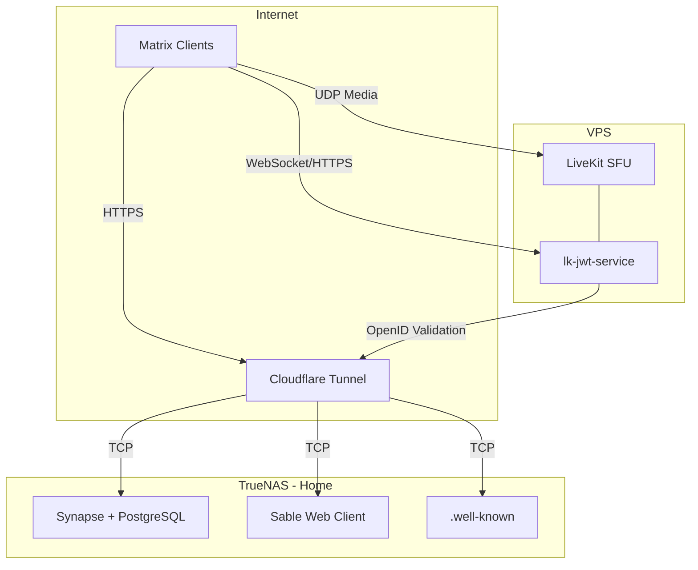

#  What is Matrix?

**Matrix** is an open, federated protocol for real-time communication. It supports text messaging, voice/video calls, file sharing, and bridging to other platforms. By self-hosting a Matrix homeserver, you own your data and can federate with the broader Matrix network or keep things entirely private.

This guide covers a full Matrix deployment across two hosts: **Synapse** (the homeserver) and a web client on TrueNAS at home behind a Cloudflare Tunnel, and **LiveKit** (the MatrixRTC voice/video backend) on a remote VPS — ensuring your home IP is never exposed.



| Component | Host | Image | Purpose |
|-----------|------|-------|---------|
| Synapse | TrueNAS | `matrixdotorg/synapse:latest` | Matrix homeserver |
| PostgreSQL | TrueNAS | `postgres:16-alpine` | Database for Synapse |
| Sable | TrueNAS | `ghcr.io/sableclient/sable:latest` | Browser client (optional) |
| LiveKit SFU | VPS | `livekit/livekit-server:latest` | Voice/video media routing |
| lk-jwt-service | VPS | `ghcr.io/element-hq/lk-jwt-service:latest` | MatrixRTC auth tokens |

> 
> Synapse and Sable run on your NAS at home — no ports need to be opened on your router since all inbound traffic arrives through the Cloudflare Tunnel. LiveKit **requires a VPS with a public IP** and open UDP ports because Cloudflare tunnels only handle HTTP/WebSocket traffic, not UDP media streams.
{.is-warning}

#  1 · Deploy Synapse + PostgreSQL

## 1.1 Generate Synapse Config

Before deploying the full stack, create a temporary compose file in Dockge to generate the Synapse config:

```yaml
services:
  synapse-generate:
    image: matrixdotorg/synapse:latest
    container_name: synapse-generate
    environment:
      - SYNAPSE_SERVER_NAME=yourdomain.com
      - SYNAPSE_REPORT_STATS=no
    volumes:
      - /mnt/tank/configs/synapse/data:/data
    command: generate
```

Run the stack — it will generate the config files and exit. Once complete, remove this temporary stack from Dockge.

> 
> The `SYNAPSE_SERVER_NAME` is your **identity domain** — it appears in user IDs like `@you:yourdomain.com`. This cannot be changed after setup. It does not need to be the same as the URL where Synapse is hosted (that's what `.well-known` delegation handles).
{.is-warning}

## 1.2 Edit homeserver.yaml

After generation, edit `/mnt/tank/configs/synapse/data/homeserver.yaml`. Find and update the following settings:

```yaml
public_baseurl: "https://matrix.yourdomain.com/"

# PostgreSQL (replace the default SQLite block)
database:
  name: psycopg2
  args:
    user: synapse
    password: your-secure-password
    database: synapse
    host: synapse-db
    cp_min: 5
    cp_max: 10

# HTTP listener (behind reverse proxy)
listeners:
  - port: 8008
    tls: false
    type: http
    x_forwarded: true
    resources:
      - names: [client, federation]
        compress: false

# Registration — disable unless you specifically want open signups
enable_registration: false

# If you DO want open registration, use these instead:
# enable_registration: true
# enable_registration_captcha: true
# recaptcha_public_key: "your-recaptcha-site-key"
# recaptcha_private_key: "your-recaptcha-secret-key"
```

To get reCAPTCHA keys, go to [Google reCAPTCHA Admin](https://www.google.com/recaptcha/admin), create a new site with **Challenge (v2)** — "I'm not a robot" checkbox, and add `matrix.yourdomain.com` as a domain.

## 1.3 Docker Compose — Synapse Stack

Deploy this in Dockge on TrueNAS:

```yaml
services:
  synapse:
    image: matrixdotorg/synapse:latest
    container_name: synapse
    restart: unless-stopped
    environment:
      - SYNAPSE_CONFIG_PATH=/data/homeserver.yaml
    volumes:
      - /mnt/tank/configs/synapse/data:/data
    ports:
      - 8008:8008
    depends_on:
      - synapse-db
    healthcheck:
      test: ["CMD", "curl", "-fSs", "http://localhost:8008/health"]
      interval: 15s
      timeout: 5s
      retries: 3
      start_period: 5s

  synapse-db:
    image: postgres:16-alpine
    container_name: synapse-db
    restart: unless-stopped
    environment:
      - POSTGRES_USER=synapse
      - POSTGRES_PASSWORD=your-secure-password
      - POSTGRES_DB=synapse
      - POSTGRES_INITDB_ARGS=--encoding=UTF-8 --lc-collate=C --lc-ctype=C
    volumes:
      - /mnt/tank/configs/synapse/db:/var/lib/postgresql/data
```

> 
> Replace `your-secure-password` with a strong, unique password — make sure it matches what you put in `homeserver.yaml`.
{.is-danger}

## 1.4 Reverse Proxy

Add a Cloudflare Tunnel route for `matrix.yourdomain.com` pointing to `http://YOUR_HOST_IP:8008`. Since the tunnel and Synapse are not on the same Docker network, use your host's LAN IP (e.g., `192.168.1.x`) with the mapped port rather than the container name.

## 1.5 Create Your First User

After the stack is running:

```bash
docker exec -it synapse register_new_matrix_user \
  -c /data/homeserver.yaml http://localhost:8008
```

Follow the prompts to create your admin account.

## 1.6 Well-Known Delegation

Matrix clients need a way to discover where your homeserver actually lives. When a user signs in with `@username:yourdomain.com`, the client makes a request to `https://yourdomain.com/.well-known/matrix/client` to find out which server to talk to. Without these files, clients won't know to connect to `matrix.yourdomain.com`.

These files must be served from your **root domain** (`yourdomain.com`), **not** from `matrix.yourdomain.com`. Two JSON responses are needed:

- `https://yourdomain.com/.well-known/matrix/client` — tells clients where the homeserver API is
- `https://yourdomain.com/.well-known/matrix/server` — tells other Matrix servers where to federate

> 
> If you're not already hosting a website on your root domain, you'll need a lightweight web server (like nginx) or a Cloudflare Worker to serve these two responses. If you already have a site on your root domain, just add the locations to your existing web server config.
{.is-info}

**Option A: Nginx** — If you have nginx serving your root domain, add these location blocks to your server config:

```nginx
location /.well-known/matrix/client {
    default_type application/json;
    add_header Access-Control-Allow-Origin *;
    add_header Access-Control-Allow-Methods 'GET, OPTIONS';
    add_header Access-Control-Allow-Headers 'Content-Type';
    return 200 '{"m.homeserver":{"base_url":"https://matrix.yourdomain.com"}}';
}

location /.well-known/matrix/server {
    default_type application/json;
    add_header Access-Control-Allow-Origin *;
    return 200 '{"m.server":"matrix.yourdomain.com:443"}';
}
```

**Option B: Static files** — If your root domain points to a simple web server or file host, create two files in a `.well-known/matrix/` directory:

`.well-known/matrix/client`:
```json
{
  "m.homeserver": {"base_url": "https://matrix.yourdomain.com"}
}
```

`.well-known/matrix/server`:
```json
{
  "m.server": "matrix.yourdomain.com:443"
}
```

Make sure CORS headers are set — the `client` file **must** return `Access-Control-Allow-Origin: *` or Matrix web clients will be blocked by the browser.

**Option C: Cloudflare Worker** — If your root domain is on Cloudflare and you don't have a web server behind it, you can create a Worker that intercepts requests to `/.well-known/matrix/*` and returns the JSON responses directly from the edge.

> 
> If you plan to use LiveKit for voice/video calling (section 3), add the `rtc_foci` entry to your client well-known now so you don't have to come back later:
{.is-success}

```json
{
  "m.homeserver": {"base_url": "https://matrix.yourdomain.com"},
  "org.matrix.msc4143.rtc_foci": [
    {"type": "livekit", "livekit_service_url": "https://rtc.yourdomain.com"}
  ]
}
```

> 
> The `rtc_foci` entry is what tells Matrix clients where to find the LiveKit SFU for voice/video calls. Without this, calls will not work.
{.is-warning}

You can verify everything works by visiting `https://yourdomain.com/.well-known/matrix/client` in your browser — you should see the JSON response.

# 2 · Deploy Sable Web Client (Optional)

If you want a browser-based client hosted on your own infrastructure, deploy Sable. You can also just use [Element](https://app.element.io) or any other Matrix client and skip this section entirely.

Create a new Dockge stack called `sable`:

```yaml
services:
  sable:
    image: ghcr.io/sableclient/sable:latest
    container_name: sable
    restart: unless-stopped
    ports:
      - 8085:8080
    volumes:
      - /mnt/tank/configs/sable/config.json:/app/config.json:ro
```

## 2.1 Client Config

Create `/mnt/tank/configs/sable/config.json`:

```json
{
  "defaultHomeserver": 0,
  "homeserverList": ["yourdomain.com"],
  "allowCustomHomeservers": true,
  "disableAccountSwitcher": false,
  "slidingSync": { "enabled": true },
  "featuredCommunities": {
    "openAsDefault": true,
    "spaces": ["#your-space:yourdomain.com"],
    "rooms": [],
    "servers": ["yourdomain.com"]
  }
}
```

Add a Cloudflare Tunnel route for `chat.yourdomain.com` pointing to `http://YOUR_HOST_IP:8085`.

# 3 · Deploy LiveKit MatrixRTC (VPS)

LiveKit acts as an SFU (Selective Forwarding Unit) that routes voice/video streams between participants. Its built-in TURN server handles firewall traversal — no separate coturn needed.

> 
> LiveKit needs direct UDP access for media traffic. You **must** deploy this on a VPS with a public IP and open UDP ports — it cannot run behind a Cloudflare tunnel for media.
{.is-danger}

## 3.1 Firewall

On the VPS, open the required UDP ports:

```bash
sudo ufw allow 3478/udp         # LiveKit built-in TURN
sudo ufw allow 50000:50100/udp   # LiveKit media relay range
```

> 
> No TCP ports need to be opened — all HTTPS signaling goes through the Cloudflare Tunnel on the VPS. Docker is not bypassing UFW here because we use `network_mode: host` and the Tunnel connector handles ingress without port mappings.
{.is-info}

## 3.2 LiveKit Config

Create `livekit.yaml` on the VPS at the path you'll mount into the container:

```yaml
port: 7880
rtc:
  node_ip: YOUR_VPS_PUBLIC_IP
  port_range_start: 50000
  port_range_end: 50100
  use_external_ip: true
  tcp_port: 7881
turn:
  enabled: true
  udp_port: 3478
keys:
  your-api-key: your-api-secret
logging:
  level: info
```

> 
> Replace `YOUR_VPS_PUBLIC_IP` with the actual public IP of your VPS. LiveKit cannot auto-discover its public IP when behind a Cloudflare Tunnel, so this must be set manually. Without it, clients won't know where to send UDP media packets.
{.is-danger}

Generate your API key and secret:

```bash
docker run --rm livekit/livekit-server generate-keys
```

## 3.3 Docker Compose — LiveKit Stack

Deploy this in Dockge on the VPS:

```yaml
services:
  livekit:
    image: livekit/livekit-server:latest
    container_name: livekit
    command: --config /etc/livekit.yaml
    restart: unless-stopped
    network_mode: host
    volumes:
      - ./livekit.yaml:/etc/livekit.yaml:ro

  lk-jwt-service:
    image: ghcr.io/element-hq/lk-jwt-service:latest
    container_name: lk-jwt-service
    restart: unless-stopped
    network_mode: host
    environment:
      - LIVEKIT_JWT_BIND=:8081
      - LIVEKIT_URL=wss://rtc.yourdomain.com
      - LIVEKIT_KEY=your-api-key
      - LIVEKIT_SECRET=your-api-secret
      - LIVEKIT_FULL_ACCESS_HOMESERVERS=yourdomain.com
```

> 
> Both services use `network_mode: host` — no `ports:` mappings are needed. This avoids Docker's iptables rules bypassing UFW. LiveKit binds directly for UDP media performance, and lk-jwt-service binds to `localhost:8081` where the Cloudflare Tunnel can reach it. Since port 8081 is not opened in UFW, it is not exposed to the internet.
{.is-info}

## 3.4 Cloudflare Tunnel Routes

Add two routes to the Cloudflare Tunnel running on the VPS. Because lk-jwt-service and LiveKit listen on different ports, you need path-based routing:

| Hostname | Path | Service | Purpose |
|----------|------|---------|---------|
| `rtc.yourdomain.com` | `/sfu/get` | `http://localhost:8081` | lk-jwt-service (MatrixRTC auth) |
| `rtc.yourdomain.com` | `/*` (catch-all) | `http://localhost:7880` | LiveKit WebSocket signaling |

> 
> In the Cloudflare Zero Trust dashboard, add `rtc.yourdomain.com` as a public hostname twice — once with the path `/sfu/get` pointing to `http://localhost:8081`, and once without a path (catch-all) pointing to `http://localhost:7880`. The `/sfu/get` route must be listed **first** so it takes priority. Both services are reachable on localhost because they use `network_mode: host`.
{.is-warning}

## 3.5 How Calls Work

1. Client reads `/.well-known/matrix/client` from `yourdomain.com` and discovers the LiveKit URL (`rtc.yourdomain.com`)
2. Client requests a JWT from lk-jwt-service at `https://rtc.yourdomain.com/sfu/get`, providing an OpenID token from Synapse
3. lk-jwt-service validates the token against Synapse and returns a signed LiveKit JWT
4. Client connects to the LiveKit SFU using the JWT over WebSocket (through the Cloudflare Tunnel)
5. Voice/video media flows directly over UDP between the client and LiveKit on the VPS public IP
6. Your home IP is never exposed — all signaling goes through tunnels, all media goes through the VPS

## 3.6 Verify

Test signaling:

```bash
curl https://rtc.yourdomain.com
# Should return: OK
```

# 4 · Configuration Reference

## 4.1 Network Summary

| Traffic Type | Path | Protocol |
|-------------|------|----------|
| Client API / Federation | Client → Cloudflare Tunnel → Synapse (TrueNAS) | HTTPS (TCP) |
| Voice/Video Signaling | Client → Cloudflare Tunnel → LiveKit (VPS) | WSS (TCP) |
| Voice/Video Media | Client → LiveKit (VPS public IP) | UDP |

## 4.2 DNS Records

| Record | Type | Value |
|--------|------|-------|
| `matrix.yourdomain.com` | CNAME | Cloudflare Tunnel (TrueNAS) |
| `rtc.yourdomain.com` | CNAME | Cloudflare Tunnel (VPS) |
| `chat.yourdomain.com` | CNAME | Cloudflare Tunnel (TrueNAS) |

## 4.3 Ports Required

**TrueNAS (firewall/router):** None — all inbound traffic arrives through the Cloudflare Tunnel. Docker ports are bound to the host for the tunnel connector to reach, but no router port forwarding is needed.

**VPS (UFW):**

| Port | Protocol | Service |
|------|----------|---------|
| 3478 | UDP | LiveKit built-in TURN |
| 50000-50100 | UDP | LiveKit media relay |

## 4.4 Federation Testing

Once deployed, verify federation is working:

1. Visit the [Matrix Federation Tester](https://federationtester.matrix.org/) and enter `yourdomain.com`
2. Confirm it resolves to `matrix.yourdomain.com:443` via `.well-known`
3. Check that the server responds with valid TLS (handled by Cloudflare)

#  5 · Video

Coming soon!