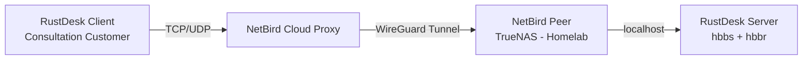

#  What is RustDesk?

**RustDesk** is an open-source remote desktop application and self-hostable alternative to TeamViewer, AnyDesk, and similar commercial tools. It provides full remote control of another computer's mouse and keyboard, file transfer, screen sharing, and clipboard sync — all with end-to-end encryption. By self-hosting the RustDesk server, you maintain complete control over your relay infrastructure with no dependency on third-party cloud services.


# 1 · Deploy RustDesk
# {.tabset}
##  Docker

```yaml
services:
  hbbs:
    container_name: hbbs
    image: rustdesk/rustdesk-server:latest
    command: hbbs
    ports:
      - "21115:21115"
      - "21116:21116"
      - "21116:21116/udp"
      - "21118:21118"
    volumes:
      - /mnt/tank/configs/rustdesk/data:/root
    depends_on:
      - hbbr
    restart: unless-stopped
  hbbr:
    container_name: hbbr
    image: rustdesk/rustdesk-server:latest
    command: hbbr
    ports:
      - "21117:21117"
      - "21119:21119"
    volumes:
      - /mnt/tank/configs/rustdesk/data:/root
    restart: unless-stopped
```

1. Deploy the stack via Dockge
1. After the containers start, retrieve your public key:
    ```bash
    cat /mnt/tank/configs/rustdesk/data/id_ed25519.pub
    ```
1. Copy this key — you'll need it when configuring clients

> No firewall changes or port forwarding are needed on TrueNAS or your router. RustDesk only needs to be reachable within your NetBird mesh — the NetBird cloud reverse proxy handles all public-facing traffic.
{.is-success}

##  TrueNAS

1. Navigate to **Apps** in the TrueNAS UI
2. Search for "**Rust Desk**" (Community train)
3. Click **Install**
4. Configure the following settings:
   - **Host Path**: `/mnt/tank/configs/rustdesk`
5. Click **Save**

> The TrueNAS community app bundles both hbbs and hbbr into a single deployment. After installation, retrieve the public key from the app's data directory.
{.is-info}

# 2 · Expose via NetBird Cloud Reverse Proxy

RustDesk traffic is raw TCP and UDP — it **cannot** be proxied through Cloudflare Tunnels, Nginx Proxy Manager, or any HTTP-only reverse proxy. However, **NetBird v0.67+** introduced Layer 4 (TCP/UDP) reverse proxy support, making it possible to expose RustDesk through the NetBird cloud proxy without opening any ports on your homelab.

## 2.1 How It Works



External RustDesk clients connect to the NetBird cloud proxy cluster. NetBird tunnels that traffic over an encrypted WireGuard connection to TrueNAS, where RustDesk server is running. Your homelab never exposes any ports to the internet.

## 2.2 Prerequisites

 - [x] NetBird cloud account with reverse proxy enabled
 - [x] TrueNAS joined to your NetBird mesh as a peer
 - [x] RustDesk server deployed on TrueNAS (Section 1)

## 2.3 Create L4 Services in NetBird Dashboard

In the NetBird dashboard, navigate to **Reverse Proxy → Services → Add Service** and create the following services. The **Target Peer** for each should be your TrueNAS machine:

| Service Name | Mode | Target Peer | Target Port | Protocol |
|-------------|------|-------------|-------------|----------|
| rustdesk-id-tcp | TCP | TrueNAS | 21116 | TCP |
| rustdesk-id-udp | UDP | TrueNAS | 21116 | UDP |
| rustdesk-relay | TCP | TrueNAS | 21117 | TCP |


After creating each service, NetBird will assign an **external port** and display the **proxy cluster domain** in the service details. Note these down — you'll need them to configure RustDesk clients.

> On NetBird's shared cloud proxy clusters, external ports are **auto-assigned** and may differ from the standard RustDesk ports. This is normal — RustDesk clients support specifying custom ports in their server configuration.
{.is-warning}

> L4 services do not support browser-based authentication (SSO, password, PIN) because there is no HTTP layer. Use **IP CIDR access restrictions** and **country-based geo-restrictions** in the NetBird dashboard to lock down who can connect.
{.is-info}


# 3 · Configure RustDesk Clients

## 3.1 Install the Client

Download the RustDesk client from [rustdesk.com](https://rustdesk.com) for Windows, macOS, Linux, iOS, or Android.

## 3.2 Point to Your Server

1. Open the RustDesk client
2. Click the **three-dot menu** (⋮) next to your ID
3. Go to **Settings → Network → ID/Relay Server**
4. Configure using the domain and ports from Section 2.3:

| Field | Value |
|-------|-------|
| **ID Server** | `remote.serversatho.me:PORT` (or NetBird proxy domain:port) |
| **Relay Server** | `remote.serversatho.me:PORT` (relay port from Section 2.3) |
| **Key** | Contents of `id_ed25519.pub` from Section 1 |
{.dense}

5. Click **Apply** or **OK**
6. The client should show a green **Ready** indicator at the bottom

> If NetBird auto-assigned non-standard ports, you **must** include the port number after the domain (e.g., `remote.serversatho.me:38721`). Without it, RustDesk will try the default ports and fail to connect.
{.is-warning}


