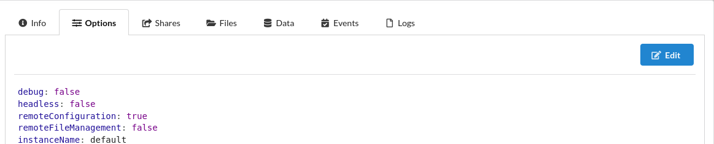

> **This Page is Under Construction!** 
{.is-danger}

# What is Soulseek?
> Soulseek is an ad-free, spyware free, just plain free file sharing network for Windows, Mac and Linux.

The [SLSKD](https://github.com/slskd/slskd/) Docker container is a client-server application allowing us to access the Soulseek network.

# Prerequisites

- Have an active account on the [Soulseek Network](https://www.slsknet.org/news/node/1)
    - Registering can be done by downloading the desktop client first and going through the first-time setup

# Docker Compose
```yaml
services:
  slskd:
    image: slskd/slskd:latest
    container_name: slskd
    ports:
      - "5030:5030"
      - "5031:5031"
      - "50300:50300"
    environment:
      - SLSKD_REMOTE_CONFIGURATION=true
      - SLSKD_SHARED_DIR=/music # Optional Directory you want to share with the network
      - SLSKD_SLSK_LISTEN_PORT=50300 # Port for the Web UI
      - SLSKD_DOWNLOADS_DIR=/music/downloads # Optional custom downloads directory
      - SLSKD_INCOMPLETE_DIR=/music/incomplete # Optional custom incomplete downloads directory
    volumes:
      - /mnt/tank/configs/soulseek:/app:rw
      - /mnt/tank/media/music:/music:rw
      - /mnt/tank/media/music/downloads:/downloads:rw
      - /mnt/tank/media/music/incomplete:/incomplete:rw
    # network_mode: service:vpn # If running VPN container
    restart: unless-stopped
```
> **NOTE:** It is not recommended to run SLSKD without a VPN, and there are a variety of containers and approaches to do so. Some threads on the matter can be found [on the SLSKD Github](https://github.com/slskd/slskd/issues/222).
{.is-danger}

# Configuration
The SLSKD server client uses a yaml configuration file located at `{application directory}/slskd.yml` - */mnt/tank/configs/soulseek/slskd.yml if you followed the above exactly*. However, this file is editable from within the slskd Web UI.

Once you have an account and have the daemon running, open the SLSKD Web UI (http://{serverIP}:5030), and sign in. The default username is *slskd* and the password is *slskd*. Click 'System' at the top right and navigate to the 'Options' tab. You will see an 'edit' button to edit the configuration file.



A window will open up where all the lines of the .yaml are commented out. You can ignore all lines, as SLSKD will load somewhat-sensible defaults for any lines not explicitly used.

Scroll to find the 'Soulseek' section, uncomment the lines:
- soulseek
- username
- password

and input your values for username and password.

Optionally, uncomment the 'description' field and input a message you want other users on the network to see when they find your profile. More information on further configuration options can be found on the [SLSKD Github page](https://github.com/slskd/slskd/blob/master/docs/config.md)

# Future Steps
SLSKD simply allows you to download files from the Soulseek network. It is not a media player. There are a variety of self-hostable music players and music management applications you can configure and use to stream your newly-shared files. A short list for further searching:
- [Jellyfin](/jellyfin.md)
- [Emby](/Emby.md)
- [Plex](/plex.md)
    - [Plexamp](https://www.plex.tv/plexamp/) - a music-dedicated client
- [Navidrome](https://www.navidrome.org/) - a self-hostable streaming service with an available docker image